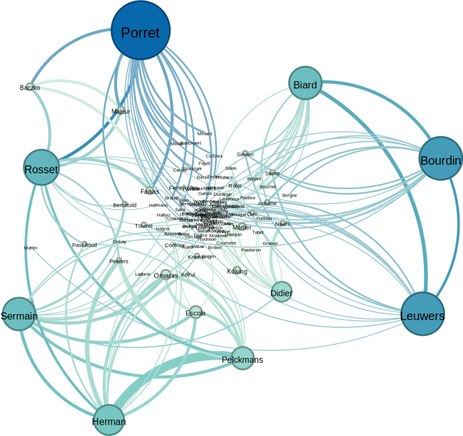

# Analyses of the 'Bibliographie: XVIIIe' dataset 

The analyses are based on the RDF version of the data (currently, v0.1.0, May 20, 2023) and have been performed by Christof Schöch. 

Note that all numbers can be expected to shift slighly as the process of cleaning the data proceeds. Collaborative authorship / editorship as well as the publication types will most likely be most affected by corrections. 

## Distribution of publications per year 

The dataset contains 64169 publication years, with 87 different publication years recorded (some of them are errors). Here, only data starting in 1986 is shown (the bibliography was launched in 1992). 

## Distribution of publication types in the dataset

There are 64397 instances of publication type (each entry has one), with just 6 different types of publication types. This number results from the original bibliography's data model, but the labels used below are Zotero's labels. The exception to this rule is that the distinction between monographs and edited volumes is lost in Zotero, which considers both to be books.  

- journalArticle: 26615
- book (monographs and edited volumes): 23083
- bookSection: 13368
- thesis: 1296
- dataset: 34
- webpage: 1

## Most frequently occurring person names 

There are 94321 mentions of person names in the dataset, in total, for 31026 different person names. 

The person names occurring most frequently in the dataset, irrespective of context or function, are the following, with the number of occurrence of their names: 

- Porret, Michel: 439
- Berchtold, Jacques: 388
- Delon, Michel: 383
- Voltaire: 346
- Seth, Catriona: 306
- Herman, Jan: 280
- Pelckmans, Paul: 267
- Moureau, François: 255
- Sermain, Jean-Paul: 240
- Bourdin, Philippe: 235

## Most frequently occurring publisher names

There are 37781 mentions of publisher names in the dataset, in total, for 5705 different publisher names. 

The publisher names occurring most frequently in the dataset, irrespective of context or function, are the following, with the number of occurrence of their names: 

- Classiques Garnier: 2354
- Honoré Champion: 1349
- Presses universitaires de Rennes: 1306
- Peter Lang: 706
- L’Harmattan: 691
- Voltaire Foundation: 682
- Droz: 552
- Presses universitaires de France: 540
- Gallimard: 523
- Cambridge University Press: 459

## Prevalence of collaboration in the dataset 

There are 56860 publications in the bibliography that have an author role (for instance monographs, journal articles and book chapters). Shown here is the number of authors in each of these publications. Single authorship is the norm, dual authorship is not uncommon, anything beyond this is exceedingly rare. 

- 1 author: 53488 (94.1%)
- 2 authors: 3361 (5.9%)
- 3 authors: 9 (0.02 %)
- 4 authors: 2 (0.004%)

There are 17135 publications in the bibliography that have an editor role (for instance edited volumes, proceedings, special issues, textual editions, etc.). Shown here is the number of editors in each of these publications. Dual editorship is the most common case, but single editorship and triple editorship are also very common. Higher numbers of editors are rarer. 

- 1 editor: 5558 (32.4%)
- 2 editors: 7743 (45.2%)
- 3 editors: 2638 (15.4%)
- 4 editors: 904 (5.3%)
- 5 editors: 256 (1.5%)
- 6 editors: 35 (0.2%)
- 11 (!) editors: (0.01%)

## Co-editor networks 

As shown above, editorship is an area of particularly intense collaboration in the community of Dix-huitiémistes, based on the data in the bibliography. 

The following is an experimental attempt at a network visualization of the top 20 co-editors (and all of their co-editors). The data of collaborations for edited volumes and editions has been massively reduced for this visualization.  

